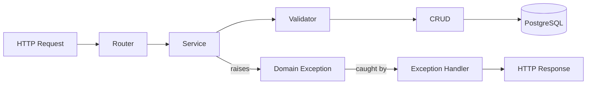
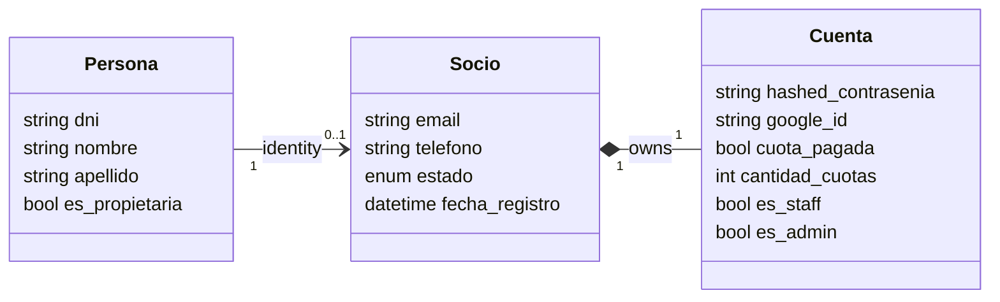
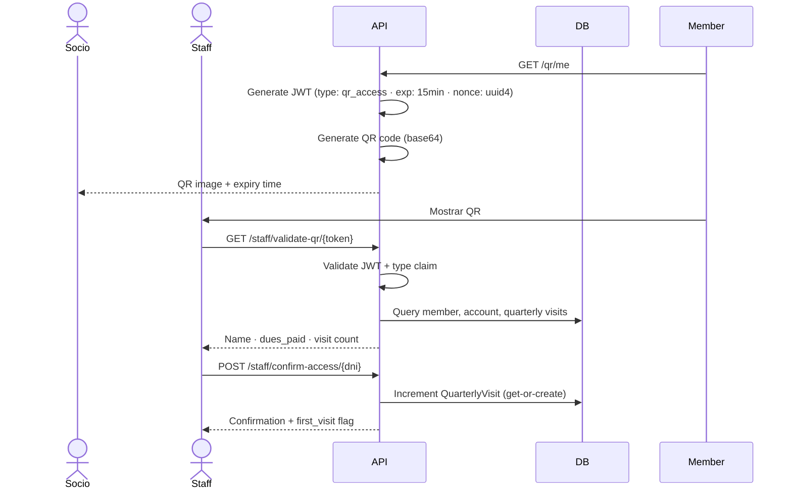

<p align="right">
  <strong>🇦🇷 Español</strong> | <a href="README.md">🇺🇸 English</a>
</p>


# Marea

<div align="center">


**Demostración del producto** · 3:33 min

<a href="https://youtu.be/mM0kiONkUeA">
  
</a>

</div>

---

## Descripción general

**SaaS** de gestión de socios para clubes, construido con FastAPI, PostgreSQL y Docker.

Actualmente está en producción y es utilizado por **usuarios reales**.<br>

- Desarrollado originalmente para un club de pesca y turismo en Pigüé, Argentina.<br>
- Dominio pensado primero en español: el personal opera completamente en español.

<p align="center">
  
  <small><em><span style="color: #6a737d;">Panel de administración</span></em></small>
</p>

---

### Puntos destacados

- SaaS en producción usado por usuarios reales
- Autenticación basada en JWT con flujo de refresh token
- Sistema de acceso físico basado en códigos QR
- Control de acceso basado en roles (RBAC)
- Seguimiento de cuotas mensuales y estado de pago
- Panel de administración con métricas en tiempo real
- Pipeline de CI/CD con GitHub Actions

---

## Arquitectura

El sistema aplica una separación estricta en cuatro capas, implementada mediante el **patrón Application Factory**.

La app nunca se instancia globalmente: se construye dentro de `create_app()`, lo que permite configuraciones específicas por entorno y hace que la conexión de middleware y manejadores de excepciones sea explícita y testeable.



<p align="center">
  
  <small><em><span style="color: #6a737d;">Endpoints en Swagger</span></em></small>
</p>

### Modelo de dominio

`Persona` *(= identidad civil)* y `Socio` *(= miembro del club)* son entidades separadas, lo que permite registrar accesos físicos de invitados y acompañantes sin crear cuentas fantasma.



---

## Decisiones técnicas

### Inyección de dependencias con closures: control de acceso basado en roles

`requires_role(roles)` devuelve una closure que FastAPI usa como dependencia, haciendo que el control de acceso sea declarativo y DRY en todos los endpoints:

```python
@router.delete("/{socio_id}", dependencies=[Depends(requires_role(["admin"]))])
async def delete_socio(...):
    ...
```

La alternativa —repetir `if not account.is_admin: raise HTTPException(403)` en 
cada endpoint— dispersa la lógica de autorización por todo el código. Con este enfoque, la autorización se declara una sola vez, se compone libremente y registra automáticamente los accesos denegados con usuario, rol e IP.

### JWT dual con secretos independientes

Access token de 15 minutos enviado en el header `Authorization`, más un refresh token firmado con una clave secreta separada y almacenado en una cookie `HttpOnly`. 
Usar secretos independientes asegura que comprometer uno no comprometa el otro.
El claim `type` se valida en cada contexto para prevenir **ataques de sustitución de tokens**, por ejemplo usando un refresh token donde se espera un access token, o un token QR en un contexto de autenticación.

### Control de acceso físico mediante códigos QR

Los socios generan un código QR que contiene un JWT de corta duración —15 minutos— con un nonce `uuid4`.
El personal lo escanea para verificar identidad, estado de cuotas y registrar el contador trimestral de visitas.
No se requiere hardware dedicado.
El endpoint de generación y el endpoint de validación están separados y requieren roles distintos.



<qr-flow-gif — generación en móvil y escaneo por parte del personal>

### Excepciones de dominio tipadas con handlers centralizados
La capa de Service lanza `MemberNotFoundError()` sin tener conocimiento de HTTP.
Un handler global de excepciones convierte la jerarquía de excepciones en `JSONResponse` con códigos de estado embebidos.
Las violaciones de unicidad a nivel de constraints de base de datos *(email, teléfono o DNI duplicados)* producen respuestas `409` semánticamente precisas por campo, sin duplicar validaciones en la capa de servicio.

### Tareas periódicas stateless

La expiración de socios pendientes y el incremento mensual de cuotas se implementan como endpoints HTTP protegidos para administradores.
La planificación se delega completamente a la infraestructura de Render mediante HTTP Cron Jobs, manteniendo la API completamente stateless y escalable horizontalmente.
Cada tarea maneja errores por ítem con rollback aislado y devuelve un log de auditoría estructurado de la operación.

### Logging estructurado con contexto preciso

Un middleware HTTP decodifica el JWT **sin verificar la firma** para extraer la identidad y el rol del actor en cada request.
Los eventos críticos de seguridad *(acceso denegado, escaneos QR, cambios de credenciales)* tienen entradas de log dedicadas con usuario, rol, IP y user-agent.
Rotación semanal con una ventana de retención de 4 semanas.

<p align="center">
  
  <small><em><span style="color: #6a737d;">Logs estructurados: cada request es trazable a un actor autenticado</span></em></small>
</p>

### Stack de middleware con orden documentado

El orden `CORS → Session → Logging → Security headers` respeta la semántica FIFO/LIFO de Starlette y está documentado en el código junto con su justificación.
`add_middleware()` ejecuta FIFO, mientras que `@app.middleware` ejecuta LIFO, por lo que requiere registración en orden inverso de ejecución.

### Pool de conexiones a la base de datos

El engine de SQLAlchemy está configurado con `pool_pre_ping=True` para validar conexiones antes de usarlas, evitando fallos silenciosos del tipo `"connection closed unexpectedly"` después de períodos de inactividad.
`pool_recycle=3600` evita usar conexiones expiradas.

### Configuración de entorno con validación tipada

`Settings` hereda de `BaseSettings` de Pydantic, validando y tipando todas las variables de entorno al iniciar la aplicación.
Si falta una variable requerida, la app falla inmediatamente con un error claro, y no recién en el primer request que la usa.
Los validadores personalizados manejan casos borde como el dominio de cookies *(`"none"` string → `None` en Python)* y los orígenes de CORS parseados desde CSV.

### Google OAuth con tres caminos distintos

El callback de OAuth maneja:
- **(A)** usuario existente con `google_id` → login directo  
- **(B)** email existente sin `google_id` → vinculación silenciosa de cuenta  
- **(C)** usuario nuevo → redirección con datos precargados para completar el perfil<br>

*El DNI y el teléfono son requeridos por el dominio; Google no los provee*.

---

## Seguridad

El diseño de seguridad se enfoca en minimizar el mal uso de tokens, limitar la superficie de ataque
y aislar dominios de falla.

### Decisiones deliberadas

- **Validación del claim de tipo de token**: cada JWT incluye un claim `type` validado por endpoint, previniendo ataques de sustitución de tokens, por ejemplo usar un refresh token como access token.
- **Secreto independiente para refresh tokens**: comprometer el secreto de access tokens no expone los refresh tokens.
- **Refresh token en cookie HttpOnly**: no es accesible desde JavaScript, eliminando XSS como vector de extracción.
- **Tokens QR con UUID nonce**: corta duración *(15 minutos) y **nonce** por generación, sin replay sin invalidación del lado del servidor.
- **Usuario de base de datos con privilegios mínimos**: el usuario de la aplicación está restringido a DML (`SELECT`, `INSERT`, `UPDATE`, `DELETE`); los cambios de esquema quedan aislados a las migraciones.
- **Dockerfile multi-stage con usuario no-root**: superficie mínima en la imagen final y menor radio de impacto ante una vulneración del contenedor.

### Base de seguridad

- Rate limiting: login (`10/hora`), registro (`5/minuto`), recuperación de contraseña (`3/minuto`)
- Hashing de contraseñas con **bcrypt**
- CORS restringido a orígenes explícitos
- Security headers: `X-Content-Type-Options`, `X-Frame-Options`,
- `Referrer-Policy`, `Content-Security-Policy`, `Permissions-Policy`
- Inyección SQL prevenida mediante **ORM**: no hay queries raw con input de usuario, junto con otras medidas de seguridad

---

## Testing

Estrategia **Testing Trophy**: tests de integración como base para cubrir flujos críticos end-to-end sin mockear infraestructura, complementados con tests unitarios sobre lógica de negocio pura cuando aportan velocidad y claridad.

La base de datos de testing es una instancia real de SQLite reemplazada mediante `dependency_overrides` de FastAPI.

Los fixtures de roles —admin, staff— ejercitan los endpoints reales de promoción: no hay atajos que inserten directamente en la base de datos.

El rate limiter se desactiva explícitamente en los tests para mantener aserciones determinísticas.

<p align="center">
  
  <small><em>CI de GitHub Actions — 38 tests pasando en cada push a main</em></small>
</p>

---

## Stack

| Capa | Tecnología |
|------------------|---------------------------------------------------|
| Framework | FastAPI 0.100+ |
| ORM | SQLModel + SQLAlchemy |
| Base de datos | PostgreSQL 16 (producción) · SQLite (tests) |
| Migraciones | Alembic |
| Autenticación | PyJWT · Passlib (bcrypt) · Authlib (OAuth) |
| Contenedorización | Docker (multi-stage) · Docker Compose |
| Deploy | Render (PaaS) |
| CI/CD | GitHub Actions |
| Testing | Pytest · pytest-asyncio · HTTPX |
| Rate limiting | SlowAPI |
| Generación de QR | qrcode |

---


🇦🇷 ¿Sos un club interesado en adaptar/utilizar este sistema? Contactame.


<div align="center">

[](https://camilosassone.vercel.app)
[](https://www.linkedin.com/in/camilosassone/)
[](mailto:camilosassone.dev@gmail.com)

</div>
