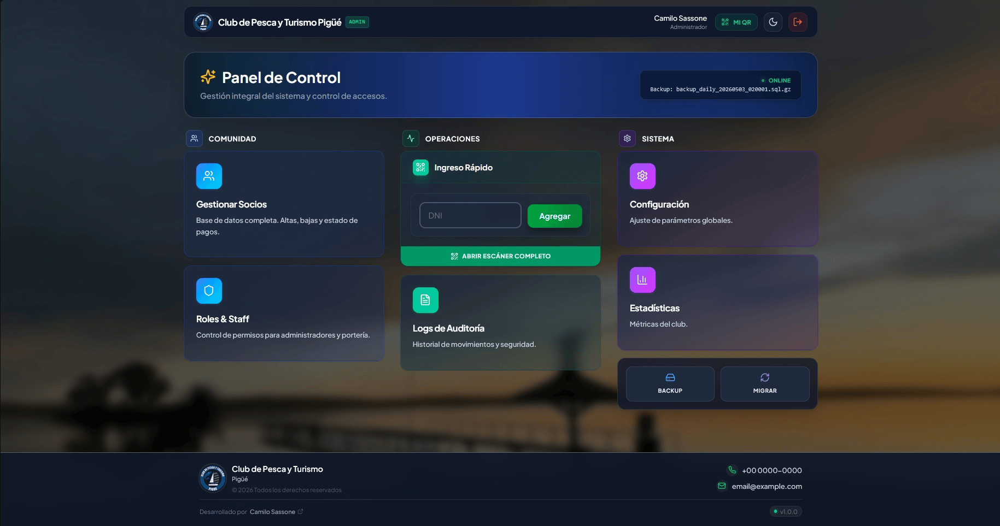
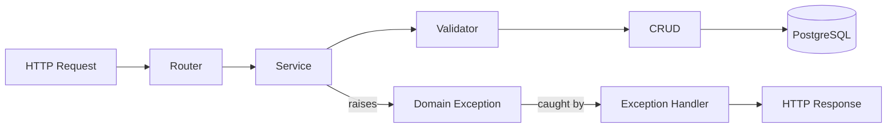
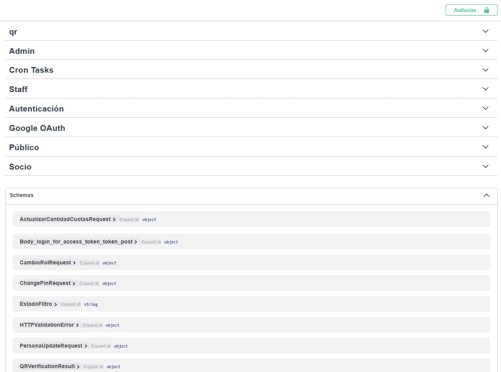
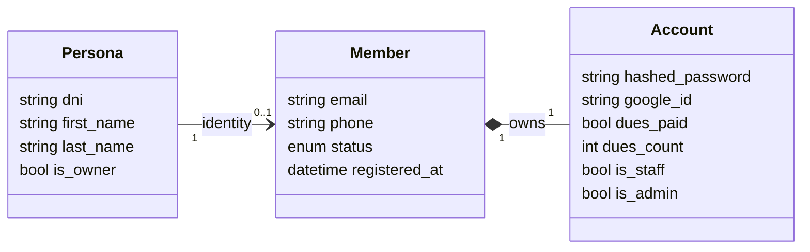
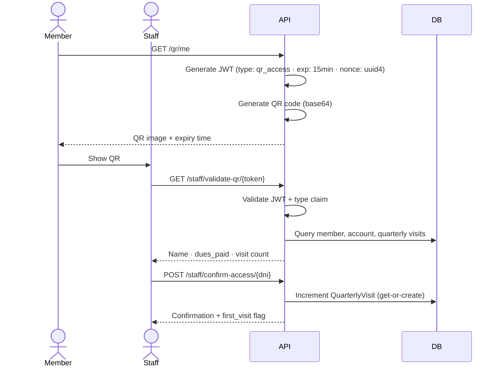
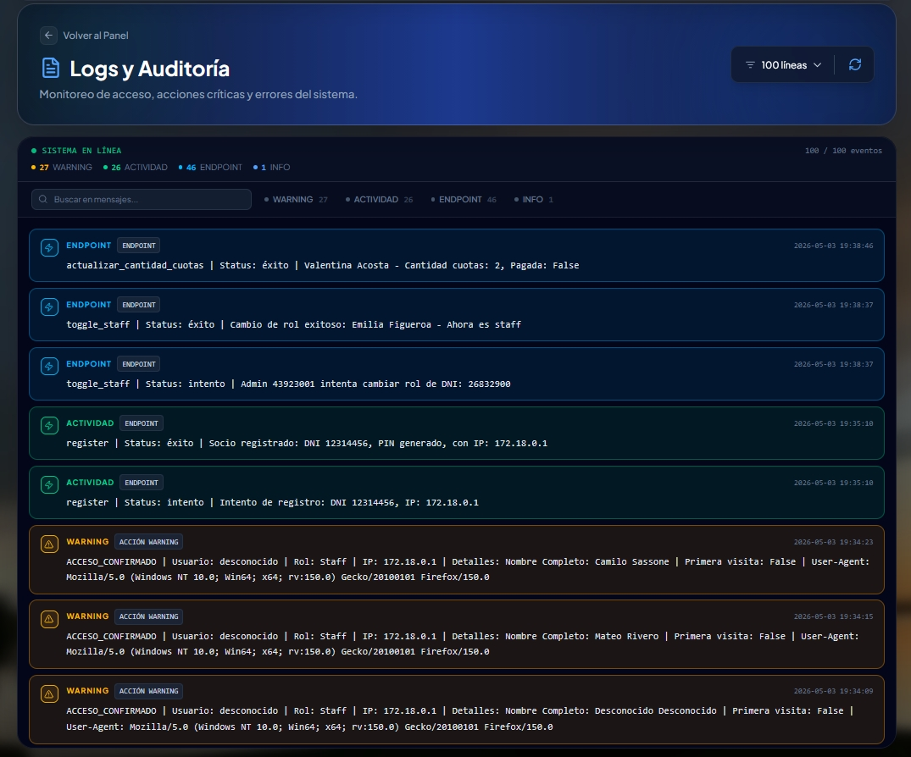
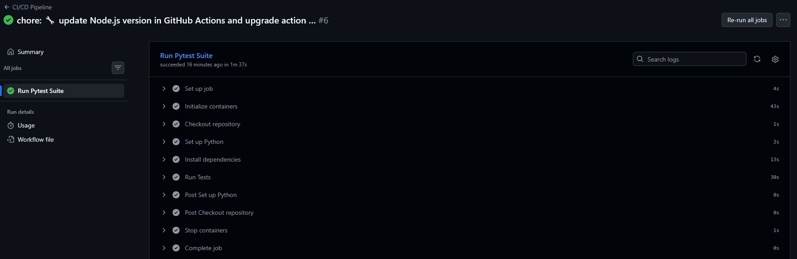

<p align="right">
  <strong>🇺🇸 English</strong> | <a href="README.es.md">🇦🇷 Español</a>
</p>

# Marea

<div align="center">


**Product Showcase** · 3:33 min

<a href="https://youtu.be/mM0kiONkUeA">
  
</a>

</div>

---

## Overview

Membership management **SaaS** for clubs, built with FastAPI, PostgreSQL and Docker.
Currently in production and used by **real users**.<br> 
- Originally developed for a fishing and tourism club in Pigüé, Argentina.<br>
- Spanish-first domain: staff operates entirely in Spanish.

<p align="center">
    
  <small><em><span style="color: #6a737d;">Admin Dashboard</span></em></small>
</p>

---

### Highlights

- Production SaaS used by real users
- JWT-based authentication with refresh flow
- QR-based physical access system
- Role-based access control (RBAC)
- Monthly dues tracking and status management
- Admin dashboard with real-time metrics
- CI/CD pipeline with GitHub Actions

---

## Architecture

The system enforces a strict four-layer separation implemented via the **Application Factory Pattern**.
The app is never instantiated globally -> it is built inside `create_app()`, enabling environment-specific
configurations and making middleware and exception handler wiring explicit and testable.



<p align="center">
  
  <small><em><span style="color: #6a737d;">Swagger endpoints</span></em></small>
</p>

### Domain model

`Persona` *( = 'person' = civil identity)* and `Socio` *( = 'member')* are separate entities,
allowing physical access to be recorded for guests and companions without creating ghost accounts.



---

## Technical decisions

### Dependency injection with closures: role-based access control

`requires_role(roles)` returns a closure that FastAPI uses as a dependency,
making access control declarative and DRY across all endpoints:

```python
@router.delete("/{socio_id}", dependencies=[Depends(requires_role(["admin"]))])
async def delete_socio(...):
    ...
```

The alternative (repeating `if not account.is_admin: raise HTTPException(403)` in
every endpoint) scatters authorization logic across the codebase. Here it is declared
once, composed freely, and logs denied access with user, role, and IP automatically.

### Dual JWT with independent secrets

15-minute access token delivered in the `Authorization` header, plus a refresh token signed with
a separate secret key stored in an `HttpOnly` cookie. Using independent secrets ensures that
compromising one does not compromise the other. The `type` claim is validated in every context
to prevent **token substitution attacks** using a refresh token where an access token is expected,
or a QR token in an authentication context.

### Physical access control via QR codes

Members generate a QR code containing a short-lived JWT (15 min) with a `uuid4` nonce.
Staff scan it to verify identity, dues status, and record the quarterly visit counter.
No dedicated hardware required. The generation endpoint and the validation endpoint are separate
and require different roles.



<qr-flow-gif — generation on mobile and staff scan>

### Typed domain exceptions with centralized handlers

The Service layer raises `MemberNotFoundError()` with no knowledge of HTTP.
A global exception handler converts the exception hierarchy into `JSONResponse` with embedded status codes.
Uniqueness violations at the DB constraint level *(duplicate email, phone, ID number)*
produce semantically precise 409s per field without duplicating validation in the service layer.

### Stateless periodic tasks

Pending member expiration and monthly dues increment are implemented as
admin-protected HTTP endpoints. Scheduling is fully delegated to Render's infrastructure
(HTTP Cron Jobs), keeping the API completely stateless and horizontally scalable.
Each task handles errors per item with isolated rollback and returns a structured audit log of the operation.

### Structured logging with *precise* context

An HTTP middleware decodes the JWT *without verifying the signature* to extract the actor's
identity and role on every request. Critical security events *(access denied, QR scans, credential changes)*
have dedicated log entries with user, role, IP, and user-agent.
Weekly rotation with a 4-week retention window.

<p align="center">
  
  <small><em><span style="color: #6a737d;">Structured logs: every request traceable to an authenticated actor</span></em></small>
</p>

### Middleware stack with documented ordering

The `CORS → Session → Logging → Security headers` order respects Starlette's FIFO/LIFO semantics
and is documented in the code with its rationale: `add_middleware()` executes FIFO while
`@app.middleware` executes LIFO, requiring registration in reverse execution order.

### Database connection pool

SQLAlchemy engine configured with `pool_pre_ping=True` to validate connections
before use, preventing silent "connection closed unexpectedly" failures after
idle periods. 
`pool_recycle=3600` prevents using expired connections.

### Environment configuration with typed validation

`Settings` inherits from Pydantic's `BaseSettings`, validating and typing all
environment variables at startup. If a required variable is missing, the app
fails immediately with a clear error and not at the first request that uses it.
Custom validators handle edge cases such as the cookie domain (`"none"` string → 
`None` Python) and CORS origins parsed from CSV.

### Google OAuth with three distinct paths

The OAuth callback handles: 
- **(A)** existing user with `google_id` → direct login,
- **(B)** existing email without `google_id` → silent account linking, 
- **(C)** new user → redirect with pre-filled data to complete profile<br>

*DNI (Government ID) and phone required by domain, not provided by Google*.

---

## Security

Security design focuses on minimizing token misuse, limiting attack surface,
and isolating failure domains.

### Deliberate decisions

- **Token type claim validation**: each JWT includes a `type` claim validated
  per endpoint, preventing token substitution attacks (e.g. refresh token used
  as access token)
- **Independent refresh token secret**: compromising the access token secret
  does not expose refresh tokens
- **Refresh token in HttpOnly cookie**: not accessible via JavaScript,
  eliminating XSS as an extraction vector
- **QR tokens with UUID nonce**: short-lived (15 min) with per-generation nonce,
  no replay without server-side invalidation
- **DB user with least privilege**: application user restricted to DML
  (SELECT, INSERT, UPDATE, DELETE), schema changes isolated to migrations
- **Multi-stage Dockerfile with non-root user**: minimal final image surface,
  reduced blast radius on container compromise

### Security baseline

- Rate limiting: login (`10/hour`), registration (`5/minute`),
  pass reset (`3/min`)
- Password hashing with **bcrypt**
- CORS restricted to explicit origins
- Security headers: `X-Content-Type-Options`, `X-Frame-Options`,
  `Referrer-Policy`, `Content-Security-Policy`, `Permissions-Policy`
- SQL injection prevented via **ORM**: no raw queries with user input (and other security measures)


---

## Testing

**Testing Trophy** strategy: integration tests as the foundation for end-to-end coverage of critical flows
without mocking infrastructure, complemented by unit tests on pure business logic where they add speed and clarity.

The test database is a real SQLite instance swapped in via FastAPI's `dependency_overrides`.
Role fixtures (admin, staff) exercise the actual promotion endpoints: no shortcuts that insert directly into the DB.

The rate limiter is explicitly disabled in tests to keep assertions deterministic.

<p align="center">
  
  <small><em>GitHub Actions CI — 38 tests passing on every push to main</em></small>
</p>

---

## Stack

| Layer            | Technology                                        |
|------------------|---------------------------------------------------|
| Framework        | FastAPI 0.100+                                    |
| ORM              | SQLModel + SQLAlchemy                             |
| Database         | PostgreSQL 16 (production) · SQLite (tests)       |
| Migrations       | Alembic                                           |
| Authentication   | PyJWT · Passlib (bcrypt) · Authlib (OAuth)        |
| Containerization | Docker (multi-stage) · Docker Compose             |
| Deploy           | Render (PaaS)                                     |
| CI/CD            | GitHub Actions                                    |
| Testing          | Pytest · pytest-asyncio · HTTPX                   |
| Rate limiting    | SlowAPI                                           |
| QR generation    | qrcode                                            |

---


🇺🇸 Are you a club interested in adapting/using this system? Contact me.<br>


<div align="center">

[](https://camilosassone.vercel.app)
[](https://www.linkedin.com/in/camilosassone/)
[](mailto:camilosassone.dev@gmail.com)

</div>
